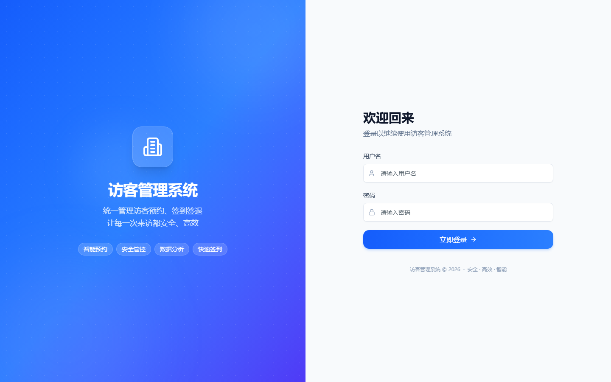
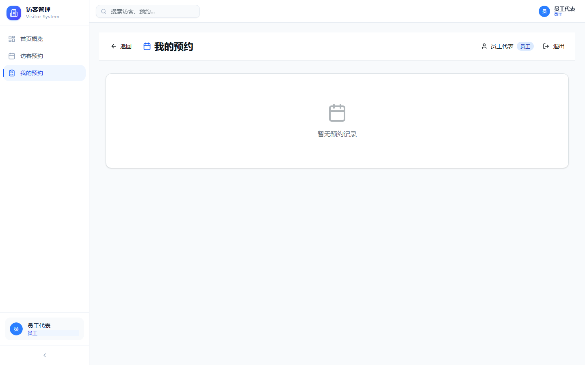
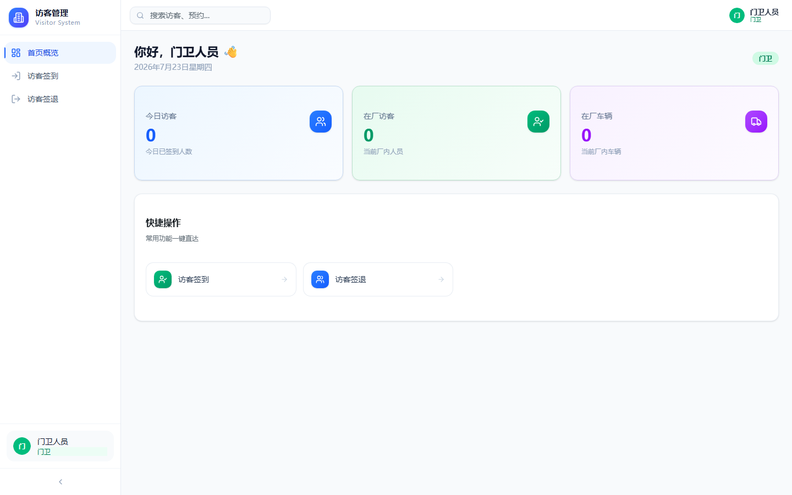
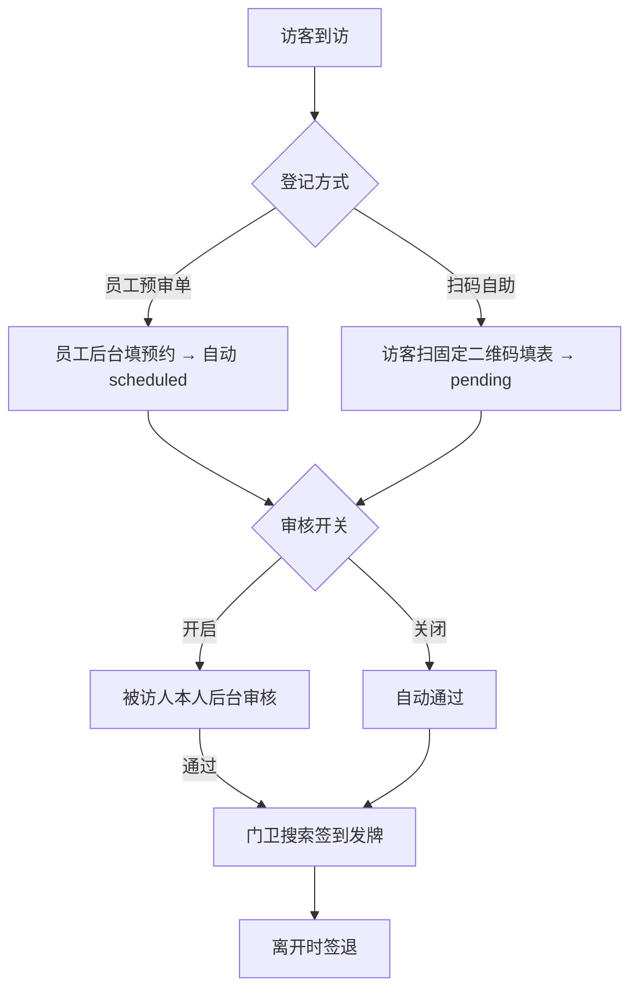
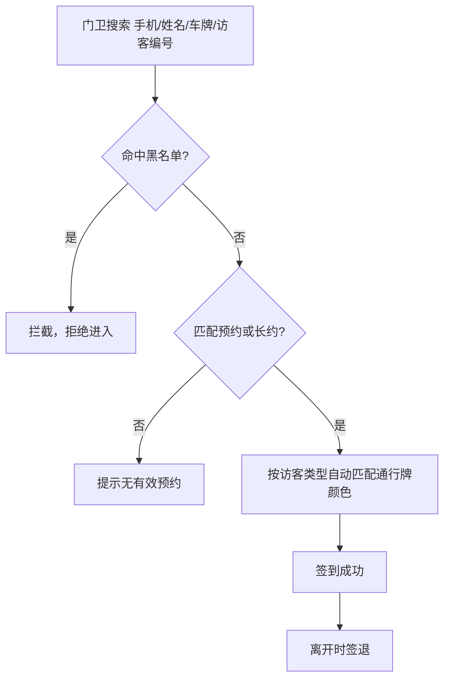

# 访客管理系统（开源版）

[](https://github.com/wangjiongwei8/visitor-management/actions/workflows/ci.yml)
[](LICENSE)

企业访客出入管理开源版。把大门这道**物理安全**关做实：访客**扫固定二维码自助预约**或被访人提前提交**预审单**，被访人（员工）**后台审核**（可开关），门卫**搜索签到发牌**——谁进了厂、何时进、是否经授权，全程留痕。

> 独立开源项目（MIT 协议），完全自托管、零外部依赖，你可部署在自己的服务器上自由使用与二次开发。

---

## 🌟 为什么选它

传统访客管理要么靠纸质登记本、要么靠前台电话反复确认——既低效，又让物理安全的第一道关形同虚设：谁进来了说不清、黑名单防不住、危险人员换个名字就能混进车间。

本系统用「二维码 + 审核 + 门卫标准化操作」把这套流程做成可审计、可管控的闭环：

- **物理安全做实**：谁进厂、何时进、是否经授权——全员留痕、操作日志可审计；黑名单实时拦截，危险人员进不来；受访人硬匹配杜绝冒名与「幽灵预约」
- **门卫提效**：被访人线上审核，门卫不再满世界打电话问「让不让进」；扫码即登或预审单直达，免去手抄登记本；长约车辆 / 人员免重复登记
- **访客零门槛**：扫固定二维码自助填表，无需注册登录，出差 / 外部人员也能用
- **可控的审核**：被访人本人审核（开关可关，关即自动通过），谁来的、谁放的清清楚楚
- **完全自托管**：部署在你自己的服务器，零外部依赖、无额外月费（数据不出企业）
- **能力完整**：通行牌颜色按访客类型自动匹配、黑名单拦截、长约车辆 / 人员、用户与密码策略、操作日志、访客看板一应俱全
- **部署简单**：Docker 一条命令起，或本地 `pnpm dev`，几分钟可用

**适用场景**：工厂 / 园区 / 写字楼 / 政府单位 / 学校 / 医院等需要把访客出入管实、管透的组织。

## ✨ 功能特性

- **扫码自助预约**：固定通用二维码，访客手机扫码填表，无需登录
- **审核开关**：管理员可开启/关闭审核；开启后由**被访人本人**审核，关闭则自动通过
- **被访人匹配**：受访人必须从系统清单下拉选定，未匹配则硬阻止提交
- **门卫签到签退**：手机号 / 姓名 / 车牌 / 访客编号搜索，黑名单自动拦截，按类型自动匹配通行牌颜色
- **完整功能**：黑名单、长约车辆/人员管理、用户管理（批量导入）、操作日志、访客看板、受访人清单、密码策略、预约管理、访客编号自动生成
- **零外部依赖**：无需邮件/短信服务即可运行

## 🔀 两种登记模式

系统支持两种并行的登记 / 审核模式，组织可任选其一或混用：

- **模式一 · 电脑端内部审核（预审单模式）**：员工在内部后台代为填写来访预约（预审单），提交后自动通过（`scheduled`）；访客 / 门卫到现场时，门卫可直接在该预审单上签到发牌，**无需访客扫码**。适合访客不便自行扫码、或由接待方提前安排的场景。
- **模式二 · 二维码扫码登记模式**：访客到现场扫描固定二维码自助填表，被访人（员工）后台审核（可开关）后门卫签到。适合公网开放、访客自助登记的场景。

两种模式共用同一套门卫签到、黑名单、通行牌、长约与看板能力，预约数据互通。

---

## 📸 界面预览与核心流程

> 真实界面截图（已在本地启动系统后自动截取）：





下方两张流程图已可直接渲染，先把核心链路讲清楚：

### 两种登记模式流程



### 门卫签到拦截逻辑



---

## 🚀 快速开始

### 方式一：Docker 一键部署（推荐）

```bash
cp .env.example .env
# 编辑 .env（注意：Docker Compose 只读取 .env，不读 .env.local），设置 DATABASE_URL 与 TOKEN_SECRET（TOKEN_SECRET 务必改为长随机串）
docker compose up -d
# 访问 http://localhost:4000
```

### 方式二：本地开发

```bash
pnpm install
cp .env.example .env.local   # 填写数据库连接与 TOKEN_SECRET
pnpm dev                     # http://localhost:3001
```

> ### ⚠️ 环境变量文件：`.env` 与 `.env.local` 的区别（很重要，搞错会跑不起来）
>
> 本项目两套运行方式读取的环境变量文件**不同**，必须对应正确，否则会出现「连不上数据库 / 缺少 TOKEN_SECRET 直接 FATAL」等问题：
>
> | 运行方式 | 实际读取的文件 | 正确做法 |
> |----------|---------------|----------|
> | **Docker 部署**（`docker compose up`） | 仅仓库根目录的 **`.env`**（Compose 的 `${VAR}` 变量插值**只认 `.env`，不读 `.env.local`**） | `cp .env.example .env` 后编辑 `.env` |
> | **本地开发**（`pnpm dev` / `next dev`） | **`.env.local`**（Next.js 自动加载；`.env` 也会被读，但 `.env.local` 优先级更高） | `cp .env.example .env.local` 后编辑 `.env.local` |
>
> **最常见的坑**：照旧文档把变量复制到 `.env.local` 再执行 `docker compose up`，Compose 读不到 `.env.local`，`DATABASE_URL` / `TOKEN_SECRET` 缺失或为空 → 应用起不来或连不上库。
>
> **一句话记忆**：**Docker 用 `.env`，本地 dev 才用 `.env.local`**。两个文件互不冲突，也可同时存在（本地 dev 时 Next.js 优先用 `.env.local`）。
>
> 所有可配置项见 `.env.example`；密钥文件已被 `.gitignore` 忽略，不会进入仓库。

### 运行测试

```bash
pnpm test                    # Vitest，27 项核心测试
```

### 生产构建

```bash
pnpm build                   # 即 next build --webpack（必须用 webpack，Turbopack 不兼容 bcryptjs）
```

### 默认账号（首次启动自动创建）

应用**首次启动**会通过 `src/lib/bootstrap.ts` 自动建表并幂等创建以下账号，**无需手动初始化**：

| 用户名 | 密码 | 角色 |
|--------|------|------|
| `admin` | `admin123` | 系统管理员 |
| `security` | `security123` | 门卫人员 |
| `employee` | `employee123` | 员工代表 |
| `visitor` | `visitor123` | 访客代表 |

> ⚠️ 登录后请**立即修改默认密码**。生产环境务必在你实际使用的环境变量文件（Docker 用 `.env`，本地 dev 用 `.env.local`）中设置强随机 `TOKEN_SECRET`（命令：`openssl rand -hex 32`），否则应用启动会直接 FATAL。

---

## ⚙️ 配置说明

所有可配置项见 `.env.example`：

| 变量 | 说明 | 必填 |
|------|------|------|
| `DATABASE_URL` | PostgreSQL 连接串 | ✅ |
| `TOKEN_SECRET` | Token 签名密钥（生产必须覆盖默认值） | ✅ |
| `NODE_ENV` | `development` / `production` | ✅ |
| `DB_PASSWORD` | 仅 Docker 部署时用于初始化数据库 | Docker 用 |

> 🔒 源码中**不含**任何客户专属密钥。密钥仅存在于本地 `.env.local` / `.env.production`，已被 `.gitignore` 忽略。

---

## 📁 目录结构（节选）

```
src/
├── app/
│   ├── api/settings/public/   # 免认证：返回审核开关状态
│   ├── public/appointment/    # 访客扫码自助预约页
│   ├── my-appointments/       # 员工端（含「待审核」Tab）
│   ├── admin/                 # 管理端（审核开关、用户、黑名单、长约…）
│   └── security/              # 门卫端
├── components/visitor/        # host-contact-search 等
├── lib/review-status.ts       # 审核状态纯函数
└── storage/database/shared/schema.ts  # Drizzle 表定义
tests/                         # Vitest 测试套件
docs/                          # PRD / 架构 / 设计总览
```

---

## 📚 文档

- [部署说明](docs/部署说明.md) — Docker / 本地部署、环境变量、初始化、备份升级
- [操作说明书](docs/操作说明书.md) — 访客 / 被访人 / 门卫 / 管理员分角色操作指引
- [设计总览](docs/总览.md) — 入口说明（功能说明、流程、决策）
- [产品需求文档](docs/PRD-访客管理系统.md)
- [架构设计](docs/ARCHITECTURE.md)
- [贡献指南](CONTRIBUTING.md) — 如何提 Issue / PR、开发环境、代码规范

---

## 🧪 质量

- 单元测试 / 路由测试：**27 / 27 通过**（Vitest）
- 生产构建：`next build --webpack` **通过**
- 源码静态审查：0 已知 Bug

---

## 💬 反馈与社区

- **GitHub Discussions（官方反馈渠道）**：功能建议、部署踩坑、使用疑问都欢迎来 [Discussions](https://github.com/wangjiongwei8/visitor-management/discussions) 交流。
- **Issue / PR**：Bug 报告与代码贡献请看 [CONTRIBUTING.md](CONTRIBUTING.md)。
- 项目完全自托管、MIT 协议，欢迎 Fork 二次开发并回来分享你的改进。

---

## 📄 许可证

[MIT](LICENSE) — 可自由用于商业与非商业用途。
