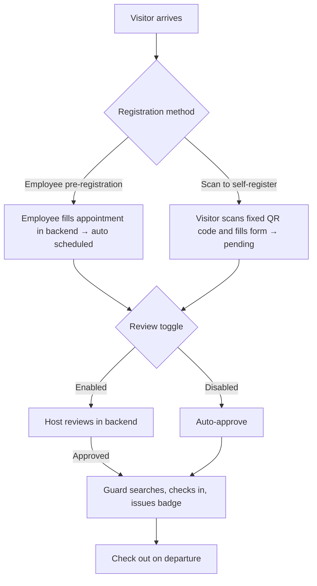
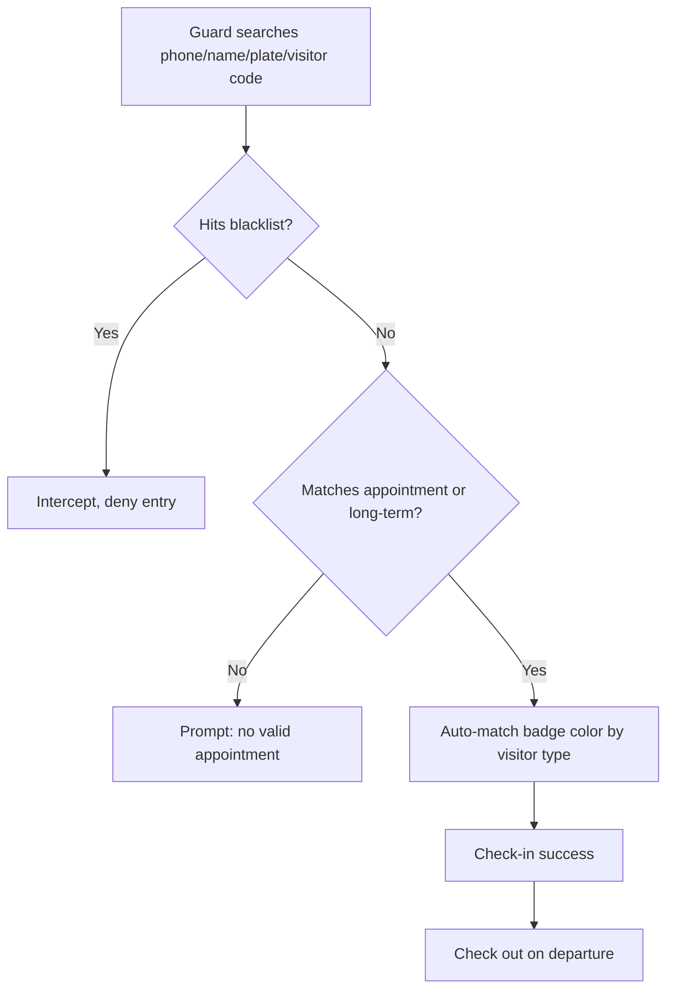

> 🇺🇸 English | 🇨🇳 [中文](README.zh-CN.md)

# Visitor Management System (Open Source)

[](https://github.com/wangjiongwei8/visitor-management/actions/workflows/ci.yml)
[](LICENSE)

An open-source enterprise visitor access management system. It makes the front gate — the physical security boundary — truly effective: visitors self-register by scanning a fixed QR code, or the host pre-submits a pre-registration form; the host (employee) reviews it in the backend (toggleable); the guard searches, checks in the visitor, and issues a badge — who entered, when, and whether authorized is fully logged.

> An independent open-source project (MIT License), fully self-hosted with zero external dependencies. Deploy on your own server and use or fork it freely.

---

## 🌟 Why Choose It

Traditional visitor management relies on paper logbooks or repeated front-desk phone calls — both inefficient and leaving the first line of physical security ineffective: you can't tell who came in, can't block the blacklist, and dangerous individuals can slip into the workshop just by changing their name.

This system turns the "QR code + review + standardized guard operation" workflow into an auditable, controllable closed loop:

- **Real physical security**: who entered, when, and whether authorized — fully logged with auditable operation logs; real-time blacklist interception blocks dangerous individuals; hard host matching prevents impersonation and "ghost appointments"
- **More efficient guards**: hosts review online, so guards no longer call around asking "should I let them in?"; scan-to-register or direct pre-registration eliminates hand-written logbooks; long-term vehicles/personnel skip repeated registration
- **Zero barrier for visitors**: scan a fixed QR code and fill in the form — no registration or login required, usable by traveling/external personnel
- **Controllable review**: the host reviews in person (toggle can be off, meaning auto-approve); who came and who let them in is crystal clear
- **Fully self-hosted**: deployed on your own server, zero external dependencies, no extra monthly fees (data stays within the enterprise)
- **Full-featured**: badge colors auto-matched by visitor type, blacklist interception, long-term vehicles/personnel, user and password policies, operation logs, and a visitor dashboard — all included
- **Easy deployment**: one Docker command, or local `pnpm dev`, ready in minutes

**Use cases**: factories / industrial parks / office buildings / government agencies / schools / hospitals — any organization that needs to manage visitor access strictly and transparently.

## ✨ Features

- **Scan-to-self-register**: a fixed universal QR code; visitors scan with their phone and fill the form — no login needed
- **Review toggle**: admins can enable/disable review; when enabled, the **host (employee)** reviews; when disabled, auto-approve
- **Host matching**: the host must be selected from a system dropdown; submission is hard-blocked if unmatched
- **Guard check-in/out**: search by phone / name / plate / visitor code; auto blacklist interception; badge color auto-matched by type
- **Complete feature set**: blacklist, long-term vehicles/personnel management, user management (bulk import), operation logs, visitor dashboard, host list, password policy, appointment management, auto-generated visitor codes
- **Zero external dependencies**: runs without email/SMS services

## 🔀 Two Registration Modes

The system supports two parallel registration/review modes; an organization can use either or both:

- **Mode 1 · Internal backend review (Pre-registration mode)**: an employee fills in the visit appointment on behalf of the visitor in the internal backend (a pre-registration form). On submission it auto-passes (`scheduled`); when the visitor/guard arrives on-site, the guard can check in and issue a badge directly from that pre-registration form, **without the visitor scanning a code**. Suitable when visitors cannot scan conveniently or when the receiving party arranges in advance.
- **Mode 2 · QR-code scan registration**: the visitor scans a fixed QR code on-site and self-registers; the host (employee) reviews in the backend (toggleable), then the guard checks in. Suitable for public-facing, visitor self-service scenarios.

Both modes share the same guard check-in, blacklist, badge, long-term, and dashboard capabilities, with appointment data interoperable.

---

## 📸 Screenshots & Core Flows

> Real interface screenshots (auto-captured after starting the system locally):


The two flowcharts below render directly and clarify the core chain:

### Two Registration Mode Flows



### Guard Check-in Interception Logic



---

## 🚀 Quick Start

### Option 1: Docker One-Command Deploy (Recommended)

```bash
cp .env.example .env
# Edit .env (note: Docker Compose reads only .env, NOT .env.local), set DATABASE_URL and TOKEN_SECRET (TOKEN_SECRET MUST be changed to a long random string)
docker compose up -d
# Visit http://localhost:4000
```

### Option 2: Local Development

```bash
pnpm install
cp .env.example .env.local   # Fill in database connection and TOKEN_SECRET
pnpm dev                     # http://localhost:3001
```

> ### ⚠️ Environment files: the difference between `.env` and `.env.local` (important — getting it wrong will break startup)
>
> The two runtime modes read **different** environment files. They must be matched correctly, otherwise you'll hit issues like "can't connect to database / missing TOKEN_SECRET → FATAL on startup":
>
> | Runtime mode | File actually read | Correct approach |
> |----------|---------------|----------|
> | **Docker deploy** (`docker compose up`) | only the root `.env` (Compose's `${VAR}` interpolation **only recognizes `.env`, not `.env.local`**) | `cp .env.example .env` then edit `.env` |
> | **Local dev** (`pnpm dev` / `next dev`) | **`.env.local`** (auto-loaded by Next.js; `.env` is also read but `.env.local` takes precedence) | `cp .env.example .env.local` then edit `.env.local` |
>
> **Most common pitfall**: copying variables into `.env.local` as the old docs said, then running `docker compose up` — Compose can't read `.env.local`, so `DATABASE_URL` / `TOKEN_SECRET` are missing or empty → the app won't start or can't reach the database.
>
> **One-line rule**: **Docker uses `.env`, local dev uses `.env.local`**. The two files don't conflict and can coexist (during local dev, Next.js prefers `.env.local`).
>
> All configurable items are in `.env.example`; secret files are ignored by `.gitignore` and never enter the repo.

### Run Tests

```bash
pnpm test                    # Vitest, 27 core tests
```

### Production Build

```bash
pnpm build                   # i.e., next build --webpack (must use webpack; Turbopack is incompatible with bcryptjs)
```

### Default Accounts (auto-created on first startup)

On **first startup**, the app uses `src/lib/bootstrap.ts` to auto-create tables and idempotently create the following accounts — **no manual initialization needed**:

| Username | Password | Role |
|--------|------|------|
| `admin` | `admin123` | System Administrator |
| `security` | `security123` | Guard |
| `employee` | `employee123` | Employee (host representative) |
| `visitor` | `visitor123` | Visitor (representative) |

> ⚠️ **Change the default passwords immediately after logging in.** In production, you MUST set a strong random `TOKEN_SECRET` in the environment file you actually use (`.env` for Docker, `.env.local` for local dev) — command: `openssl rand -hex 32` — otherwise the app will FATAL on startup.

---

## ⚙️ Configuration

All configurable items are in `.env.example`:

| Variable | Description | Required |
|------|------|------|
| `DATABASE_URL` | PostgreSQL connection string | ✅ |
| `TOKEN_SECRET` | Token signing secret (must override default in production) | ✅ |
| `NODE_ENV` | `development` / `production` | ✅ |
| `DB_PASSWORD` | Used only for DB initialization in Docker deploy | Docker only |

> 🔒 The source code contains **no** customer-specific secrets. Secrets exist only in local `.env.local` / `.env.production`, ignored by `.gitignore`.

---

## 📁 Directory Structure (excerpt)

```
src/
├── app/
│   ├── api/settings/public/   # No auth: returns review toggle status
│   ├── public/appointment/    # Visitor scan-to-self-register page
│   ├── my-appointments/       # Employee console (with "Pending Review" tab)
│   ├── admin/                 # Admin console (review toggle, users, blacklist, long-term…)
│   └── security/              # Guard console
├── components/visitor/        # host-contact-search, etc.
├── lib/review-status.ts       # Review status pure functions
└── storage/database/shared/schema.ts  # Drizzle table definitions
tests/                         # Vitest test suite
docs/                          # PRD / Architecture / overview docs
```

---

## 📚 Documentation

- [Deployment Guide](docs/部署说明.md) — Docker / local deploy, env vars, initialization, backup & upgrade
- [Operations Manual](docs/操作说明书.md) — role-based guidance for visitor / host / guard / admin
- [Design Overview](docs/总览.md) — entry doc (features, flows, decisions)
- [Product Requirements Document](docs/PRD-访客管理系统.md)
- [Architecture Design](docs/ARCHITECTURE.md)
- [Contributing Guide](CONTRIBUTING.md) — how to file Issues / PRs, dev environment, code style

---

## 🧪 Quality

- Unit / route tests: **27 / 27 passing** (Vitest)
- Production build: `next build --webpack` **passes**
- Source static review: 0 known bugs

---

## 💬 Feedback & Community

- **GitHub Discussions (official feedback channel)**: feature suggestions, deployment pitfalls, and usage questions are all welcome in [Discussions](https://github.com/wangjiongwei8/visitor-management/discussions).
- **Issue / PR**: see [CONTRIBUTING.md](CONTRIBUTING.md) for bug reports and code contributions.
- The project is fully self-hosted under the MIT License. Fork it, build on it, and share your improvements.

---

## 📄 License

[MIT](LICENSE) — free for commercial and non-commercial use.
