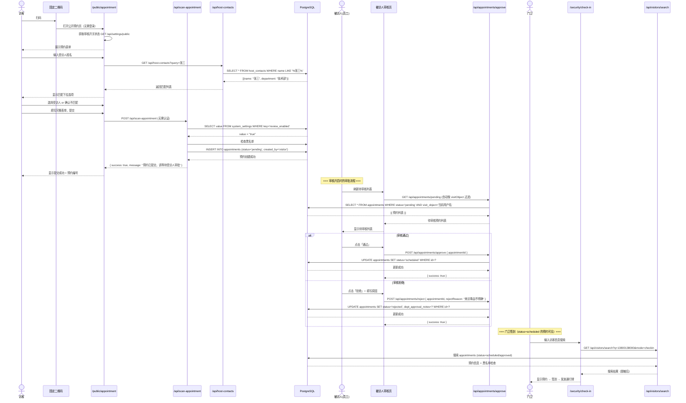
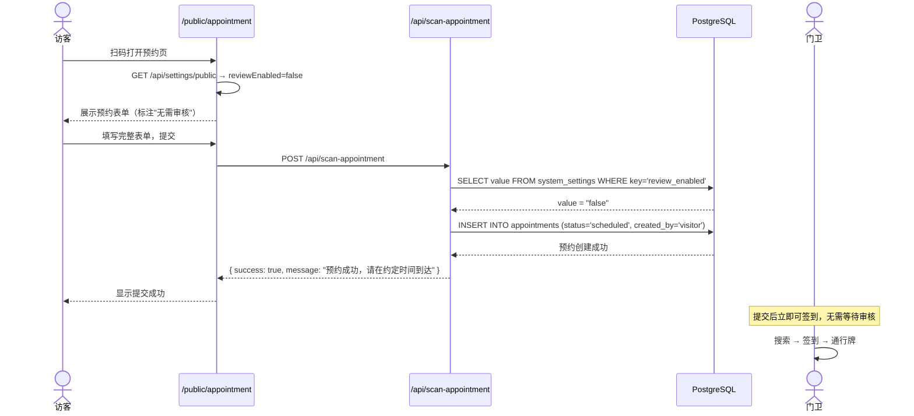
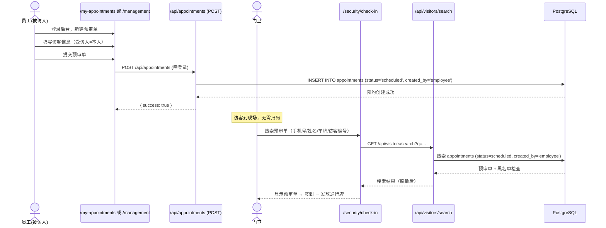
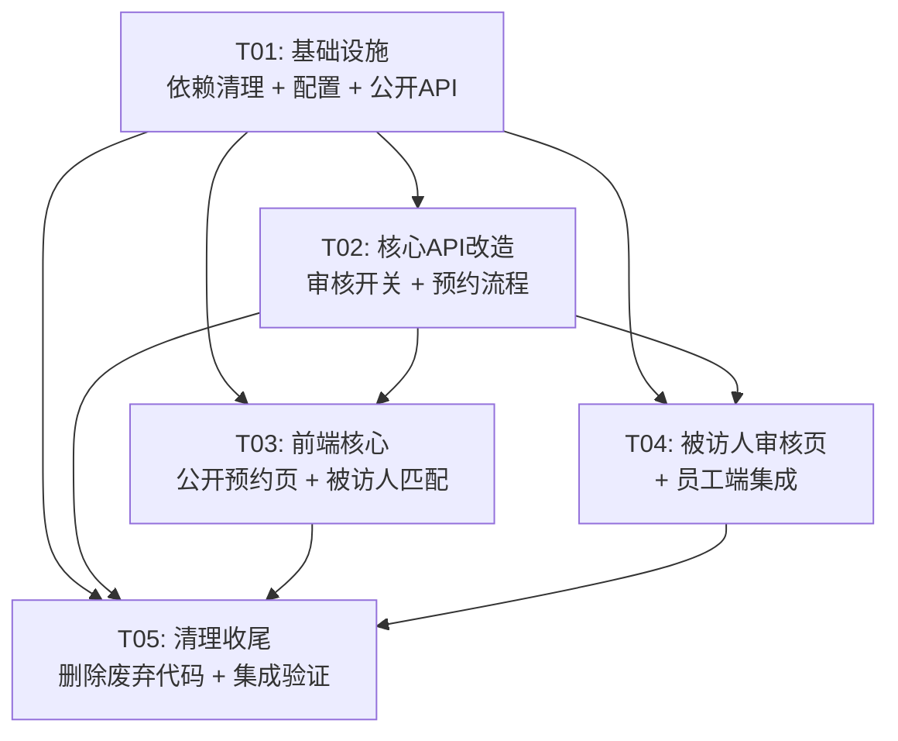

> 🇺🇸 English | 🇨🇳 [中文](ARCHITECTURE.zh-CN.md)

# Visitor Management System (Open Source) — System Architecture Design + Task Breakdown

> **Architect**: Bob  
> **Date**: 2025-07-16  
> **Based on version**: v1.0.0  
> **Tech stack**: Next.js 16 (App Router) + TypeScript + Tailwind CSS + shadcn/ui + Drizzle ORM + PostgreSQL  

---

## 1. Current State Analysis

### 1.1 Core Modules to Modify

| Module | Change type | Current state | Target |
|------|----------|---------|---------|
| **Public appointment page** `/public/appointment` | 🔄 Modify | Shows "employee login / visitor appointment" choice | Directly show visitor appointment form (remove employee login entry) |
| **Scan appointment API** `/api/scan-appointment` | 🔄 Modify | status fixed `pending` after submit | Decide by review toggle: ON→`pending`, OFF→`scheduled` |
| **Appointment create API** `/api/appointments` POST | 🔄 Modify | Requires login (admin/employee), status fixed `scheduled` | Keep existing logic; employee-created still auto-approves |
| **Pending approval list API** `/api/appointments/pending` | 🔄 Modify | Already filtered by visitObject (employee) | Mostly satisfied; confirm frontend display |
| **Approve/Reject API** | ✅ Usable | Permission limited to admin/host | Reuse, no change |
| **System settings API** `/api/admin/settings` | 🔄 Modify | Has `auto_approve` key | Add `review_enabled` key as review toggle |
| **Host matching** | 🆕 New | No frontend matching logic | Match against host_contacts in real time when visitor fills host |
| **Visitor appointment form** `ScanAppointmentForm` | 🔄 Modify | Exists but needs host matching | Add host_contacts search/confirm interaction |
| **Review toggle management page** | 🆕 New | No standalone page | Add review toggle control in admin backend |
| **Host review list page** | 🆕 New | No standalone page | Employee can view their own pending list |

### 1.2 Modules to Delete

| Module | Files/dirs | Notes |
|------|--------------|------|
| **Email system** | `src/lib/email.ts`, `/api/admin/email-config/`, `/api/admin/notification-recipients/`, `/api/admin/notification-tasks/`, `/api/scheduler/run/` | PRD explicitly removes email notifications |
| **Visitor badge printing** | `/api/visit-cards/`, `visitCards` table in `src/lib/schema.ts` | PRD explicitly removes visitor badge printing |
| **Notification system** | `notificationTasks`, `notificationRecipientGroups`, `notificationRecipients` tables in `src/storage/database/shared/schema.ts` | Depends on email system |
| **One-click approval** `auto_approve` | Old key in system settings | Replaced by `review_enabled` |

### 1.3 Fully Retained Modules (unchanged)

| Module | Key files | Notes |
|------|---------|------|
| User auth & RBAC | `src/lib/auth.ts`, `src/middleware.ts`, `/api/auth/*` | Cookie + HMAC-SHA256 token mechanism unchanged |
| Guard check-in | `/security/check-in/`, `/api/visitors/search/`, `visitor-check-in.tsx` | Check-in flow unchanged |
| Guard check-out | `/security/check-out/`, `/api/visit-records/checkout/` | Check-out flow unchanged |
| Blacklist management | `/admin/blacklist/`, `/api/blacklist/`, `src/lib/blacklist.ts` | Check-in interception logic unchanged |
| Long-term vehicles/personnel | `/admin/long-term-vehicles/`, `/api/long-term-vehicles/`, `visitor-search.tsx` | All retained |
| User management | `/admin/users/`, `/api/admin/users/` | CRUD, bulk import unchanged |
| Password policy | `/admin/password-policy/`, `/api/admin/password-policy/` | Complexity, expiry, lockout unchanged |
| Operation logs | `/api/stats/`, middleware logs | Retained |
| Appointment management | `/management/`, `/api/appointments/query/`, `/api/visitors/management-query/` | Retained |
| Visitor dashboard | `/api/stats/`, `page.tsx` stat cards | Retained |
| Host list | `/admin/host-contacts/`, `/api/host-contacts/` | Retained |
| Data export | `/api/visitors/management-query/` export logic | Retained |

---

## 2. Implementation Plan + Framework Selection

### 2.1 Core Change Strategy

**Principle: minimal change — never modify code that doesn't need to be modified.**

This is not a rewrite but an incremental enhancement on existing code. The core changes are only three things:

1. **Simplify public appointment entry**: `/public/appointment` removes identity selection and directly shows the visitor form
2. **Review toggle + auto-approve logic**: use the existing `system_settings` table, add `review_enabled` key
3. **Host real-time matching**: reuse the existing `/api/host-contacts?query=` API, add a search dropdown on the frontend

### 2.2 Tech Selection

| Decision | Choice | Reason |
|--------|------|------|
| Review toggle storage | `system_settings` table, key=`review_enabled` | Reuse existing infra, no new table |
| Host matching | Frontend autocomplete + existing `/api/host-contacts?query=` | API already supports fuzzy search, no backend change |
| QR code generation | Keep `qrcode` package + `/admin/qrcode` page | Already fully implemented, URL points to `/public/appointment` |
| Status enum | Reuse existing enum: `pending/scheduled/checked_in/checked_out/rejected/cancelled` | No new status needed |
| Framework version | Next.js 16 + React 19 + Drizzle ORM 0.45 | Keep, no upgrade |

### 2.3 Two Modes of the Review Toggle

```
┌─────────────────────────────────────────────────────┐
│              Review toggle (review_enabled)          │
├──────────────────────┬──────────────────────────────┤
│       Off (false)    │         On (true)             │
├──────────────────────┼──────────────────────────────┤
│ Visitor submit → scheduled │ Visitor submit → pending │
│ Guard can check in directly │ → Host reviews          │
│ No manual intervention     │   → Approve → scheduled   │
│                            │   → Reject → rejected (with reason) │
└──────────────────────┴──────────────────────────────┘
```

### 2.4 Two Registration Modes

The system supports two parallel registration modes, fully sharing the guard check-in flow:

- **Mode 1 · Internal backend review (Pre-registration mode)**: an employee fills the visit appointment on behalf of the visitor in the internal backend (a pre-registration form), reusing the existing `/api/appointments` POST (requires login, `createdBy=employee`); on submit status is fixed `scheduled`, **not entering pending review and not triggering host review**. When the visitor/guard arrives, the guard searches that pre-registration directly on the check-in page and checks in & issues a badge, **without the visitor scanning**.
- **Mode 2 · QR-code scan registration**: the visitor scans the fixed `/public/appointment` QR code on-site and self-registers, submitted via `/api/scan-appointment`, entering `pending` (host review) or `scheduled` (auto-approve) per `review_enabled`, see 5.1 / 5.2.

Both modes write to the same `appointments` table, differing only in `created_by` and status transition; the guard check-in search presents both uniformly.

---

## 3. File Change List

### 3.1 New Files (NEW)

| Path | Description |
|----------|------|
| `src/components/visitor/host-contact-search.tsx` | Host real-time search & match component (autocomplete) |
| `src/app/api/settings/public/route.ts` | Public API: frontend fetches review toggle status (no auth) |

### 3.2 Modified Files (MODIFY)

| Path | Change |
|----------|---------|
| `src/app/public/appointment/page.tsx` | **Major simplification**: remove identity selection + employee login view, render visitor form directly |
| `src/components/visitor/scan-appointment-form.tsx` | Integrate HostContactSearch component; fix `scan-appointment` API path |
| `src/app/api/scan-appointment/route.ts` | On submit read `review_enabled`: OFF → status=scheduled, ON → status=pending |
| `src/app/api/admin/settings/route.ts` | GET adds `reviewEnabled`; POST adds handling for `reviewEnabled` |
| `src/middleware.ts` | Adjust publicPaths: remove deprecated paths like `/scan-appointment`; confirm `/public` in allowlist |
| `src/app/my-appointments/page.tsx` | Add "Pending Review" tab (shown only when `review_enabled=true` and there are pending appointments) |
| `src/app/page.tsx` | Add pending-review count badge on employee home |

### 3.3 Deleted Files (DELETE)

| Path | Description |
|----------|------|
| `src/lib/email.ts` | Email sending module (not needed) |
| `src/lib/scheduler.ts` | Scheduled tasks (depends on email) |
| `src/app/api/admin/email-config/route.ts` | Email config API |
| `src/app/api/admin/email-config/test/route.ts` | Email test API |
| `src/app/api/admin/notification-recipients/route.ts` | Notification address API |
| `src/app/api/admin/notification-recipients/[id]/route.ts` | Notification address detail API |
| `src/app/api/admin/notification-tasks/route.ts` | Notification task API |
| `src/app/api/scheduler/run/route.ts` | Scheduled task trigger API |
| `src/app/api/visit-cards/route.ts` | Visitor badge API |
| `src/app/api/visit-cards/latest/route.ts` | Visitor badge latest API |
| `src/app/api/scan-appointment/route.ts` (old scan-appointment page) | old sca-appointment route (if exists) |
| `src/app/scan-appointment/page.tsx` | Old scan appointment page |
| `src/app/scan/page.tsx` | Old scan page |

### 3.4 Retained Files (KEEP, no change)

| Module | File scope |
|------|---------|
| Auth system | `src/lib/auth.ts`, `src/middleware.ts` (only minor public-path tweaks) |
| Database | `src/lib/db.ts`, `src/storage/database/shared/schema.ts` |
| UI component library | `src/components/ui/*` (all shadcn/ui components) |
| Admin backend | `src/app/admin/users/*`, `src/app/admin/blacklist/*`, `src/app/admin/host-contacts/*`, `src/app/admin/long-term-vehicles/*`, `src/app/admin/password-policy/*`, `src/app/admin/qrcode/*` |
| Guard console | `src/app/security/*`, `src/components/security/*` |
| Appointment management | `src/app/management/*`, `src/app/appointment/*` |
| Layout | `src/app/layout.tsx`, `src/components/layout/app-layout.tsx` |
| API routes (kept) | All blacklist, host-contacts, long-term-vehicles, users, visitors, visit-records, stats, auth, appointments (except approve/pending/reject modifications) related APIs |

---

## 4. Data Structure & Interfaces

### 4.1 DB Table Changes

**No new DB tables or columns needed.** All changes go through the `system_settings` table.

| Change | Detail |
|------|------|
| New setting | Insert into `system_settings` key=`review_enabled`, value=`"true"`, description=`"Review toggle: when on, visitor appointments require host review"` |
| Deprecated setting | key=`auto_approve` kept but no longer read (backward compatible) |

**seed/migration SQL (suggested)**:
```sql
INSERT INTO system_settings (key, value, description)
VALUES ('review_enabled', 'true', 'Review toggle: when on, visitor appointments require host review')
ON CONFLICT (key) DO NOTHING;
```

### 4.2 API List

#### New APIs

| Method | Path | Auth | Description |
|------|------|------|------|
| GET | `/api/settings/public` | None | Returns `{ reviewEnabled: boolean }` for the public appointment page |

#### Modified APIs

| Method | Path | Change |
|------|------|---------|
| POST | `/api/scan-appointment` | On submit read `review_enabled`: `false` → status=`scheduled`; `true` → status=`pending` |
| GET | `/api/admin/settings` | Response adds `reviewEnabled` field |
| POST | `/api/admin/settings` | Supports updating `reviewEnabled` |

#### Deleted APIs

| Method | Path |
|------|------|
| ALL | `/api/admin/email-config` |
| ALL | `/api/admin/email-config/test` |
| ALL | `/api/admin/notification-recipients` |
| ALL | `/api/admin/notification-recipients/[id]` |
| ALL | `/api/admin/notification-tasks` |
| ALL | `/api/scheduler/run` |
| ALL | `/api/visit-cards` |
| ALL | `/api/visit-cards/latest` |

#### Retained APIs (unchanged)

The following APIs are all unchanged and reused directly:

| Module | Path |
|------|------|
| Auth | `/api/auth/login`, `/api/auth/logout`, `/api/auth/me`, `/api/auth/change-password`, `/api/auth/password-policy` |
| Appointment | `/api/appointments` (GET/POST), `/api/appointments/[id]`, `/api/appointments/approve`, `/api/appointments/reject`, `/api/appointments/pending`, `/api/appointments/query` |
| My Appointments | `/api/my-appointments` |
| Visitor | `/api/visitors/search`, `/api/visitors`, `/api/visitors/management-query`, `/api/visitors/delete` |
| Check-in/out | `/api/visit-records`, `/api/visit-records/checkout`, `/api/visit-records/today` |
| Blacklist | `/api/blacklist`, `/api/blacklist/[id]` |
| Host | `/api/host-contacts`, `/api/host-contacts/[id]`, `/api/host-contacts/batch-delete` |
| Long-term vehicle | `/api/long-term-vehicles`, `/api/long-term-vehicles/send-reminder` |
| User management | `/api/admin/users`, `/api/admin/users/[id]`, `/api/admin/users/batch-delete`, `/api/admin/users/import` |
| Password policy | `/api/admin/password-policy` |
| Stats | `/api/stats` |
| Dashboard | `/api/visitor-board` |
| QR code | `/api/admin/qrcode` (if exists) |
| Health check | `/api/health` |

### 4.3 Data Flow: Review Toggle Decision Logic

```
scan-appointment POST handler:

1. Query system_settings WHERE key = 'review_enabled'
2. reviewEnabled = (setting.value === 'true')
3. if reviewEnabled:
     status = 'pending'
     createdBy = 'visitor'
   else:
     status = 'scheduled'
     createdBy = 'visitor'
4. Insert into appointments table
5. Return result
```

---

## 5. Sequence Diagrams

### 5.1 Full Scan Flow (review on)



### 5.2 Full Scan Flow (review off)



### 5.3 Pre-registration Full Flow (Mode 1, employee-filled)



---

## 6. Task List

### 6.1 Task Overview

| Task ID | Name | Priority | Est. files | Deps |
|---------|---------|--------|-----------|------|
| T01 | Project infra: dependency cleanup + config update + public entry | P0 | ~8 | None |
| T02 | Core API: review toggle + appointment flow + public settings | P0 | ~6 | T01 |
| T03 | Frontend core: public appointment page + host match component | P0 | ~5 | T01, T02 |
| T04 | Host review page + employee console integration | P0 | ~4 | T01, T02 |
| T05 | Cleanup: delete deprecated code + middleware adjust + integration verify | P1 | ~15 (delete) | T01-T04 |

---

### 6.2 Task Details

#### T01: Project infra: dependency cleanup + config update + public settings API

**Description**:
1. Remove email/S3 related deps from `package.json`: `nodemailer`, `@types/nodemailer`, `@aws-sdk/client-s3`, `@aws-sdk/lib-storage`
2. Run `pnpm install` to update lockfile
3. Add `/api/settings/public` route: no auth, returns `{ reviewEnabled: boolean }`
4. Ensure `system_settings` has `review_enabled` seed logic (in `auth.ts` init or a new migration)
5. Update middleware.ts publicPaths: add `/api/settings/public`, clean deprecated paths

**Source files**:
- `package.json` (MODIFY)
- `pnpm-lock.yaml` (MODIFY - auto-generated)
- `src/app/api/settings/public/route.ts` (NEW)
- `src/middleware.ts` (MODIFY)
- `src/lib/auth.ts` (MODIFY - add review_enabled init)
- `src/lib/schema.ts` (MODIFY - adjust exports if relevant)

**Deps**: None  
**Priority**: P0

---

#### T02: Core API: review toggle logic + appointment flow

**Description**:
1. Modify `/api/scan-appointment/route.ts`: on submit read `review_enabled`; ON → pending, OFF → scheduled
2. Modify `/api/admin/settings/route.ts`: GET returns `reviewEnabled`; POST supports `reviewEnabled` update
3. Modify `/api/appointments/pending/route.ts`: confirm employee role only sees pending where visitObject is self (verify logic)
4. Confirm `/api/appointments/approve` and `/api/appointments/reject` permission logic (existing: only admin or visitObject matcher)

**Source files**:
- `src/app/api/scan-appointment/route.ts` (MODIFY)
- `src/app/api/admin/settings/route.ts` (MODIFY)
- `src/app/api/appointments/pending/route.ts` (MODIFY - minor confirm)
- `src/storage/database/shared/schema.ts` (MODIFY - add REVIEW_ENABLED key to SYSTEM_SETTING_KEYS)

**Deps**: T01  
**Priority**: P0

---

#### T03: Frontend core: public appointment page + host match component

**Description**:
1. **Modify `src/app/public/appointment/page.tsx`**:
   - Remove identity selection ("employee login / visitor appointment" choice) view
   - Remove employee login form view
   - On page load fetch review toggle via `/api/settings/public`
   - Render `ScanAppointmentForm` directly
   - Show different hint text by review state ("needs review" / "no review needed")

2. **New `src/components/visitor/host-contact-search.tsx`**:
   - Input box + dropdown search list
   - Call `/api/host-contacts?query=` for real-time search
   - Show matches (name + department)
   - When no match, show "No matching host found; will be recorded as a new host" confirmation prompt

3. **Modify `src/components/visitor/scan-appointment-form.tsx`**:
   - Replace host input with `HostContactSearch` component
   - Adapt form style for mobile

**Source files**:
- `src/app/public/appointment/page.tsx` (MODIFY - major simplification)
- `src/components/visitor/host-contact-search.tsx` (NEW)
- `src/components/visitor/scan-appointment-form.tsx` (MODIFY)

**Deps**: T01, T02  
**Priority**: P0

---

#### T04: Host review page + employee console integration

**Description**:
1. **Modify `src/app/my-appointments/page.tsx`**:
   - Add "Pending Review" tab, calls `/api/appointments/pending` for list
   - Each pending item shows: visitor name, phone, visit purpose, appointment time, action buttons (approve/reject)
   - On reject, pop a dialog requiring a reason
   - Hide this tab when review toggle is off

2. **Modify `src/app/page.tsx` (home)**:
   - Employee home: add pending-review count badge
   - Click jumps to my-appointments pending tab

3. Call existing `/api/appointments/approve` and `/api/appointments/reject` APIs

**Source files**:
- `src/app/my-appointments/page.tsx` (MODIFY)
- `src/app/page.tsx` (MODIFY)
- `src/app/api/appointments/pending/route.ts` (MODIFY - optimize)

**Deps**: T01, T02  
**Priority**: P0

---

#### T05: Cleanup: delete deprecated code + middleware adjust + integration verify

**Description**:
1. Delete all email-related files (see 3.3 delete list)
2. Delete visitor badge printing related API routes
3. Remove `visitCards` table definition from `src/lib/schema.ts` (keep Drizzle schema clean)
4. Remove notification-related tables from `src/storage/database/shared/schema.ts`: `notificationTasks`, `notificationRecipientGroups`, `notificationRecipients`, `emailConfig`
5. Delete old pages: `src/app/scan-appointment/`, `src/app/scan/` (if exist and deprecated)
6. Adjust `src/middleware.ts`: clean deprecated public paths, ensure `/public`, `/api/settings/public` correctly pass
7. Final integration test: verify full flow

**Source files**:
- `src/lib/email.ts` (DELETE)
- `src/lib/scheduler.ts` (DELETE)
- `src/app/api/admin/email-config/route.ts` (DELETE)
- `src/app/api/admin/email-config/test/route.ts` (DELETE)
- `src/app/api/admin/notification-recipients/route.ts` (DELETE)
- `src/app/api/admin/notification-recipients/[id]/route.ts` (DELETE)
- `src/app/api/admin/notification-tasks/route.ts` (DELETE)
- `src/app/api/scheduler/run/route.ts` (DELETE)
- `src/app/api/visit-cards/route.ts` (DELETE)
- `src/app/api/visit-cards/latest/route.ts` (DELETE)
- `src/app/scan-appointment/page.tsx` (DELETE)
- `src/app/scan/page.tsx` (DELETE)
- `src/lib/schema.ts` (MODIFY - remove visitCards table definition)
- `src/storage/database/shared/schema.ts` (MODIFY - remove notification tables)
- `src/middleware.ts` (MODIFY - clean + confirm)

**Deps**: T01, T02, T03, T04  
**Priority**: P1

---

## 7. Dependency List

### 7.1 Removed Dependencies

```
- nodemailer: email sending (not needed)
- @types/nodemailer: nodemailer type defs
- @aws-sdk/client-s3: S3 client (email attachment storage)
- @aws-sdk/lib-storage: S3 upload tool
```

### 7.2 Retained Dependencies (none added)

This system introduces no new npm packages. All features use existing deps:
- `qrcode` — existing, QR generation
- `react-hook-form` + `zod` — existing, form validation
- `drizzle-orm` + `drizzle-kit` — existing, ORM
- `shadcn/ui` (radix-ui family) — existing, UI components
- `date-fns` — existing, date handling

---

## 8. Shared Knowledge

### 8.1 Status Enum (reuse existing, unchanged)

```typescript
// Appointment status
type AppointmentStatus = 'pending' | 'scheduled' | 'checked_in' | 'checked_out' | 'rejected' | 'cancelled';

// Creation source
type CreatedBy = 'employee' | 'visitor';  // employee=created by employee (auto-approve), visitor=created by visitor scan

// Visitor type
type VisitorType = 'customer' | 'supplier' | 'applicant' | 'delivery' | 'government' | 'visit';

// Badge color
type PassColor = 'green' | 'yellow' | 'red';
```

### 8.2 System Setting Keys

```typescript
const SYSTEM_SETTING_KEYS = {
  REVIEW_ENABLED: 'review_enabled',  // new: review toggle
  AUTO_APPROVE: 'auto_approve',      // legacy: one-click approval (deprecated but kept)
} as const;
```

### 8.3 API Path Conventions

```
/api/settings/public          → Public settings API (no auth), returns { reviewEnabled }
/api/scan-appointment         → Visitor scan appointment (no auth)
/api/appointments/pending     → Pending list (auth), auto-filtered by visitObject
/api/appointments/approve     → Approve (auth)
/api/appointments/reject      → Reject (auth)
/api/host-contacts?query=     → Host search (no-auth GET)
/api/admin/settings           → Admin settings (admin role)
```

### 8.4 Frontend Route Conventions

```
/public/appointment    → Public appointment page (visitor scan entry, no auth)
/my-appointments       → My Appointments (employee: with Pending Review tab)
/login                 → Login page
/admin/qrcode          → QR code management (generates /public/appointment QR)
/admin/settings        → System settings (review toggle here)
```

### 8.5 Data Masking Rules (reuse existing)

- Name: keep first char, replace rest with `*` (e.g. "张三" → "张*")
- Phone: first 3 + `****` + last 4 (e.g. "13800138000" → "138****8000")
- ID: first 4 + `****` + last 4
- **Long-term vehicles/personnel**: not masked (guards need real info)

### 8.6 Token Auth

- Cookie: `auth-token`, format `Base64(payload).HMAC-SHA256(payload)`
- Validity: 24 hours
- httpOnly + sameSite strict
- Public APIs (`/api/scan-appointment`, `/api/settings/public`) need no token

### 8.7 Date Storage Convention

- DB storage: UTC (the `d-1 16:00` trick ensures correct China-time dates)
- Query display: `AT TIME ZONE 'Asia/Shanghai'`
- Frontend input/display: `YYYY-MM-DD` string

---

## 9. Open Items

### 9.1 Open Questions from PRD

| ID | Question | Design suggestion |
|----------|------|---------|
| **Q-01** | Does the "review toggle" need to distinguish visitor types (e.g. some auto-approve, some require review)? | ✅ **Confirmed: no distinction for now.** Single global toggle |
| **Q-02** | Host matching: if the host the visitor enters is not in `host_contacts`, reject submission or just prompt to confirm? | ✅ **Confirmed: reject submission.** When host not in list, block submit and prompt visitor to contact admin to add the host |
| **Q-03** | During host review, can the host modify appointment info (e.g. visit time)? | ✅ **Confirmed: approve/reject only, no modification** |
| **Q-04** | When the review toggle is off, should existing pending old appointments be bulk-converted to scheduled? | ✅ **Confirmed: no auto-conversion, affects new submissions only** |
| **Q-05** | Should guard check-in search exclude `rejected` appointments? | ✅ **Confirmed: exclude rejected** |
| **Q-06** | Any length limit or preset templates for reject reason? | ✅ **Confirmed: no reason required on reject.** Reject directly, no reason field needed |
| **Q-07** | Add CAPTCHA before submit on the public appointment page (anti-bot)? | ✅ **Confirmed: not added for now** |

### 9.2 Additional Findings / Open Points

| ID | Finding | Suggestion |
|------|------|------|
| **A-01** | Existing code has heavy duplicate table definitions in `src/lib/schema.ts` and `src/storage/database/shared/schema.ts` (visitors, appointments, blacklist, vehicles, visitRecords) | **Suggest: clean duplicates.** Treat `storage/database/shared/schema.ts` as source of truth; `lib/schema.ts` keeps only its unique tables (hostContacts, receipts, safetyEquipment, visitCards). Code debt, doesn't affect function, can be handled in T05 |
| **A-02** | After deleting notification tables (notificationTasks etc.), how to handle existing data in the DB? | **Suggest: keep the DB tables, no DROP.** Only remove code references. Removing the table definition from Drizzle schema won't affect existing DB tables; the ORM just stops accessing them |
| **A-03** | Should old `src/app/scan-appointment/` and `src/app/scan/` be deleted? | **Suggest: delete in T05.** Safe to delete after confirming no references |
| **A-04** | Existing `auto_approve` system setting has opposite semantics to `review_enabled` (auto_approve=true ≈ review_enabled=false) | **Suggest: `review_enabled` default `true` (review on), safer.** After install, review is required by default, lowering security risk |

---

## 10. Task Dependency Graph



---

> **Doc version**: v1.0.0  
> **Review status**: **Confirmed** — all Q decisions locked, Q2=reject submission, Q6=no reason, others per suggestion
