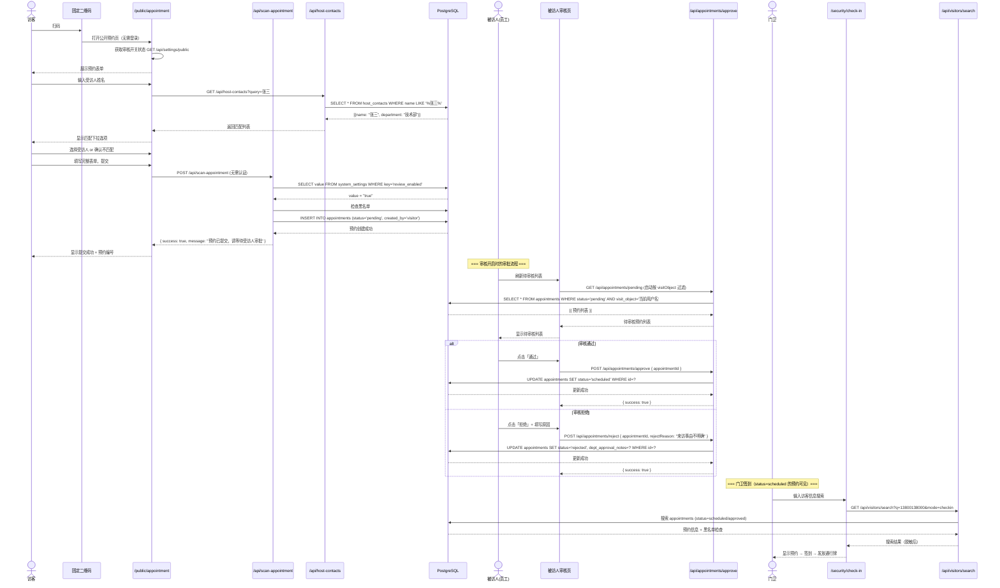
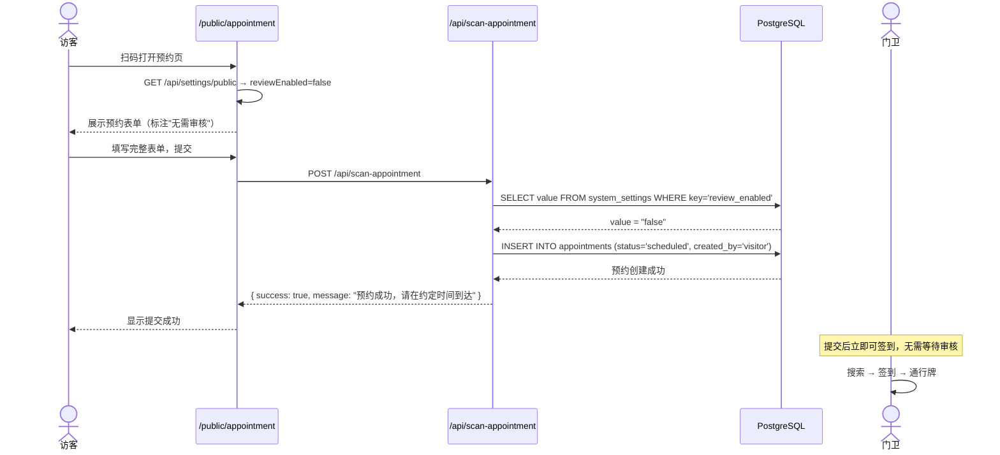
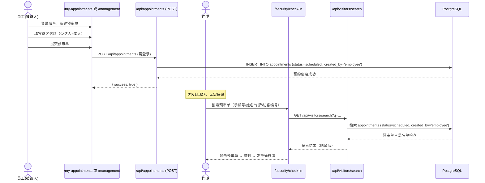
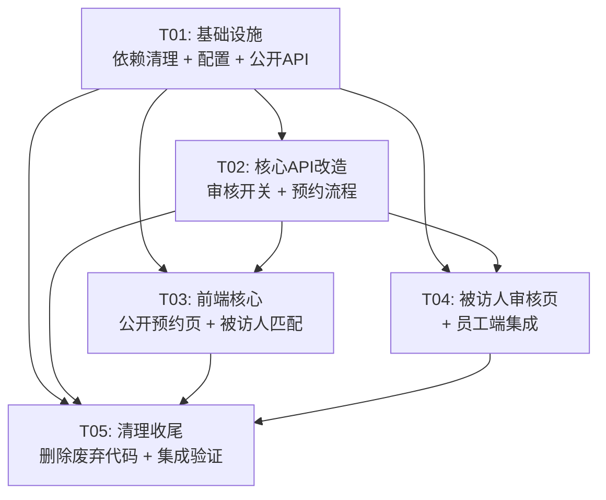

# 访客管理系统（开源版）— 系统架构设计 + 任务分解

> **Architect**: Bob  
> **Date**: 2025-07-16  
> **基于版本**: v1.0.0  
> **技术栈**: Next.js 16 (App Router) + TypeScript + Tailwind CSS + shadcn/ui + Drizzle ORM + PostgreSQL  

---

## 1. 现状分析

### 1.1 需要修改的核心模块

| 模块 | 变更类型 | 现有状态 | 目标 |
|------|----------|---------|---------|
| **公开预约页面** `/public/appointment` | 🔄 修改 | 显示"员工登录 / 访客预约"二选一 | 直接展示访客预约表单（移除员工登录入口） |
| **扫码预约 API** `/api/scan-appointment` | 🔄 修改 | 提交后 status 固定为 `pending` | 根据审核开关决定：ON→`pending`，OFF→`scheduled` |
| **预约创建 API** `/api/appointments` POST | 🔄 修改 | 需登录（admin/employee），status 固定 `scheduled` | 保留原有逻辑，员工创建的仍自动通过 |
| **待审批列表 API** `/api/appointments/pending` | 🔄 修改 | 已按 visitObject 过滤（员工） | 基本满足，需确认前端展示 |
| **审批/驳回 API** | ✅ 可用 | 权限已限制为 admin/受访人 | 复用，无需改动 |
| **系统设置 API** `/api/admin/settings` | 🔄 修改 | 已有 `auto_approve` 键 | 新增 `review_enabled` 键作为审核开关 |
| **被访人匹配** | 🆕 新增 | 前端无匹配逻辑 | 访客填受访人时从 host_contacts 实时匹配 |
| **访客预约表单** `ScanAppointmentForm` | 🔄 修改 | 存在但需增加受访人匹配 | 增加 host_contacts 搜索/确认交互 |
| **审核开关管理页** | 🆕 新增 | 无独立页面 | 在管理后台增加审核开关控件 |
| **被访人审核列表页** | 🆕 新增 | 无独立页面 | 员工可查看自己的待审核列表 |

### 1.2 需要删除的模块

| 模块 | 涉及文件/目录 | 说明 |
|------|--------------|------|
| **邮件系统** | `src/lib/email.ts`, `/api/admin/email-config/`, `/api/admin/notification-recipients/`, `/api/admin/notification-tasks/`, `/api/scheduler/run/` | PRD 明确移除邮件通知 |
| **访客证打印** | `/api/visit-cards/`, `src/lib/schema.ts` 中 `visitCards` 表定义 | PRD 明确移除访客证打印 |
| **通知系统** | `src/storage/database/shared/schema.ts` 中 `notificationTasks`, `notificationRecipientGroups`, `notificationRecipients` 表 | 依赖邮件系统 |
| **一键审批** `auto_approve` | 系统设置中的旧键 | 替换为 `review_enabled` |

### 1.3 完整保留的模块（不变）

| 模块 | 关键文件 | 说明 |
|------|---------|------|
| 用户认证与 RBAC | `src/lib/auth.ts`, `src/middleware.ts`, `/api/auth/*` | Cookie + HMAC-SHA256 token 机制不变 |
| 门卫签到 | `/security/check-in/`, `/api/visitors/search/`, `visitor-check-in.tsx` | 签到流程完全不变 |
| 门卫签退 | `/security/check-out/`, `/api/visit-records/checkout/` | 签退流程完全不变 |
| 黑名单管理 | `/admin/blacklist/`, `/api/blacklist/`, `src/lib/blacklist.ts` | 签到拦截逻辑不变 |
| 长约车辆/人员 | `/admin/long-term-vehicles/`, `/api/long-term-vehicles/`, `visitor-search.tsx` | 全部保留 |
| 用户管理 | `/admin/users/`, `/api/admin/users/` | 增删改查、批量导入不变 |
| 密码策略 | `/admin/password-policy/`, `/api/admin/password-policy/` | 复杂度、过期、锁定不变 |
| 操作日志 | `/api/stats/`, middleware 日志 | 保留 |
| 预约管理 | `/management/`, `/api/appointments/query/`, `/api/visitors/management-query/` | 保留 |
| 访客看板 | `/api/stats/`, `page.tsx` 统计卡片 | 保留 |
| 受访人清单 | `/admin/host-contacts/`, `/api/host-contacts/` | 保留 |
| 数据导出 | `/api/visitors/management-query/` 导出逻辑 | 保留 |

---

## 2. 实现方案 + 框架选型

### 2.1 核心改动策略

**原则：最小变更，能不改的代码绝对不改。**

本系统不是重写，而是在现有代码基础上的增量改造。核心改动只有三件事：

1. **公开预约入口简化**：`/public/appointment` 去掉身份选择，直接展示访客表单
2. **审核开关 + 自动通过逻辑**：利用现有 `system_settings` 表新增 `review_enabled` 键
3. **被访人实时匹配**：复用已有 `/api/host-contacts?query=` API，在前端加搜索下拉

### 2.2 技术选型

| 决策点 | 选择 | 理由 |
|--------|------|------|
| 审核开关存储 | `system_settings` 表，key=`review_enabled` | 复用现有基础设施，无需新增表 |
| 被访人匹配 | 前端 autocomplete + 已有 `/api/host-contacts?query=` | API 已支持模糊搜索，无需后端改动 |
| 二维码生成 | 保留 `qrcode` 包 + `/admin/qrcode` 页面 | 已有完整实现，URL 指向 `/public/appointment` |
| 状态枚举 | 沿用现有枚举: `pending/scheduled/checked_in/checked_out/rejected/cancelled` | 无需新增状态 |
| 框架版本 | Next.js 16 + React 19 + Drizzle ORM 0.45 | 保持不变，不升级 |

### 2.3 审核开关的两种模式

```
┌─────────────────────────────────────────────────────┐
│              审核开关 (review_enabled)               │
├──────────────────────┬──────────────────────────────┤
│       关闭 (false)    │        开启 (true)            │
├──────────────────────┼──────────────────────────────┤
│ 访客提交 → scheduled │ 访客提交 → pending           │
│ 门卫可直接签到       │ → 被访人审核                  │
│ 无需人工干预         │   → 通过 → scheduled          │
│                      │   → 拒绝 → rejected (附原因)  │
└──────────────────────┴──────────────────────────────┘
```

### 2.4 两种登记模式

系统支持两种并行的登记模式，门卫签到流程完全共用：

- **模式一 · 电脑端内部审核（预审单模式）**：员工在内部后台代为填写来访预约（预审单），复用已有 `/api/appointments` POST（需登录，`createdBy=employee`），提交后状态固定为 `scheduled`，**不进入待审核、不触发被访人审核**。访客 / 门卫到现场时，门卫在签到页直接搜索该预审单并签到发牌，**无需访客扫码**。
- **模式二 · 二维码扫码登记模式**：访客现场扫描 `/public/appointment` 固定二维码自助填表，经 `/api/scan-appointment` 提交，按 `review_enabled` 进入 `pending`（被访人审核）或 `scheduled`（自动通过），见 5.1 / 5.2。

两种模式写入同一 `appointments` 表，仅 `created_by` 与状态流转不同；门卫签到搜索对两者统一呈现。

---

## 3. 文件变更清单

### 3.1 新增文件 (NEW)

| 相对路径 | 说明 |
|----------|------|
| `src/components/visitor/host-contact-search.tsx` | 被访人实时搜索匹配组件（autocomplete） |
| `src/app/api/settings/public/route.ts` | 公开 API：前端获取审核开关状态（无需登录） |

### 3.2 修改文件 (MODIFY)

| 相对路径 | 变更说明 |
|----------|---------|
| `src/app/public/appointment/page.tsx` | **重大简化**：移除身份选择 + 员工登录视图，直接渲染访客表单 |
| `src/components/visitor/scan-appointment-form.tsx` | 集成 HostContactSearch 组件；修正 `scan-appointment` API 路径 |
| `src/app/api/scan-appointment/route.ts` | 提交时读取 `review_enabled` 设置：OFF → status=scheduled, ON → status=pending |
| `src/app/api/admin/settings/route.ts` | GET 新增返回 `reviewEnabled`；POST 新增处理 `reviewEnabled` |
| `src/middleware.ts` | 调整 publicPaths：移除 `/scan-appointment` 等废弃路径；确认 `/public` 在白名单 |
| `src/app/my-appointments/page.tsx` | 新增「待审核」tab（仅在 `review_enabled=true` 且有 pending 预约时显示） |
| `src/app/page.tsx` | 在员工角色首页增加待审核数量提醒 badge |

### 3.3 删除文件 (DELETE)

| 相对路径 | 说明 |
|----------|------|
| `src/lib/email.ts` | 邮件发送模块（不需要） |
| `src/lib/scheduler.ts` | 定时任务（依赖邮件） |
| `src/app/api/admin/email-config/route.ts` | 邮件配置 API |
| `src/app/api/admin/email-config/test/route.ts` | 邮件测试 API |
| `src/app/api/admin/notification-recipients/route.ts` | 通知地址 API |
| `src/app/api/admin/notification-recipients/[id]/route.ts` | 通知地址详情 API |
| `src/app/api/admin/notification-tasks/route.ts` | 通知任务 API |
| `src/app/api/scheduler/run/route.ts` | 定时任务触发 API |
| `src/app/api/visit-cards/route.ts` | 访客证 API |
| `src/app/api/visit-cards/latest/route.ts` | 访客证最新 API |
| `src/app/api/scan-appointment/route.ts` (旧 scan-appointment 页) | sca-appointment 旧路由（如存在） |
| `src/app/scan-appointment/page.tsx` | 旧扫码预约页 |
| `src/app/scan/page.tsx` | 旧扫码页 |

### 3.4 保留文件 (KEEP，无变更)

| 模块 | 文件范围 |
|------|---------|
| 认证系统 | `src/lib/auth.ts`, `src/middleware.ts`（仅微调 public paths） |
| 数据库 | `src/lib/db.ts`, `src/storage/database/shared/schema.ts` |
| UI 组件库 | `src/components/ui/*` (全部 shadcn/ui 组件) |
| 管理后台 | `src/app/admin/users/*`, `src/app/admin/blacklist/*`, `src/app/admin/host-contacts/*`, `src/app/admin/long-term-vehicles/*`, `src/app/admin/password-policy/*`, `src/app/admin/qrcode/*` |
| 门卫端 | `src/app/security/*`, `src/components/security/*` |
| 预约管理 | `src/app/management/*`, `src/app/appointment/*` |
| 布局 | `src/app/layout.tsx`, `src/components/layout/app-layout.tsx` |
| API 路由（保留） | 所有 blacklist、host-contacts、long-term-vehicles、users、visitors、visit-records、stats、auth、appointments（除 approve/pending/reject 外的修改）相关 API |

---

## 4. 数据结构和接口

### 4.1 数据库表变更

**无需新增任何数据库表或字段。** 所有改动通过 `system_settings` 表实现。

| 变更 | 详情 |
|------|------|
| 新增设置项 | `system_settings` 表插入 key=`review_enabled`, value=`"true"`, description=`"审核开关：开启后访客预约需被访人审核"` |
| 废弃设置项 | key=`auto_approve` 保留但不再读取（向后兼容） |

**seed/migration SQL（建议）**:
```sql
INSERT INTO system_settings (key, value, description)
VALUES ('review_enabled', 'true', '审核开关：开启后访客预约需被访人审核')
ON CONFLICT (key) DO NOTHING;
```

### 4.2 API 接口清单

#### 新增 API

| 方法 | 路径 | 认证 | 说明 |
|------|------|------|------|
| GET | `/api/settings/public` | 无 | 返回 `{ reviewEnabled: boolean }`，供公开预约页判断 |

#### 修改 API

| 方法 | 路径 | 变更说明 |
|------|------|---------|
| POST | `/api/scan-appointment` | 提交时读取 `review_enabled`：`false` → status=`scheduled`；`true` → status=`pending` |
| GET | `/api/admin/settings` | 响应新增 `reviewEnabled` 字段 |
| POST | `/api/admin/settings` | 支持更新 `reviewEnabled` |

#### 删除 API

| 方法 | 路径 |
|------|------|
| ALL | `/api/admin/email-config` |
| ALL | `/api/admin/email-config/test` |
| ALL | `/api/admin/notification-recipients` |
| ALL | `/api/admin/notification-recipients/[id]` |
| ALL | `/api/admin/notification-tasks` |
| ALL | `/api/scheduler/run` |
| ALL | `/api/visit-cards` |
| ALL | `/api/visit-cards/latest` |

#### 保留 API（无变更）

以下全部 API 保持不变，直接复用：

| 模块 | 路径 |
|------|------|
| 认证 | `/api/auth/login`, `/api/auth/logout`, `/api/auth/me`, `/api/auth/change-password`, `/api/auth/password-policy` |
| 预约 | `/api/appointments` (GET/POST), `/api/appointments/[id]`, `/api/appointments/approve`, `/api/appointments/reject`, `/api/appointments/pending`, `/api/appointments/query` |
| 我的预约 | `/api/my-appointments` |
| 访客 | `/api/visitors/search`, `/api/visitors`, `/api/visitors/management-query`, `/api/visitors/delete` |
| 签到签退 | `/api/visit-records`, `/api/visit-records/checkout`, `/api/visit-records/today` |
| 黑名单 | `/api/blacklist`, `/api/blacklist/[id]` |
| 受访人 | `/api/host-contacts`, `/api/host-contacts/[id]`, `/api/host-contacts/batch-delete` |
| 长约车 | `/api/long-term-vehicles`, `/api/long-term-vehicles/send-reminder` |
| 用户管理 | `/api/admin/users`, `/api/admin/users/[id]`, `/api/admin/users/batch-delete`, `/api/admin/users/import` |
| 密码策略 | `/api/admin/password-policy` |
| 统计 | `/api/stats` |
| 看板 | `/api/visitor-board` |
| 二维码 | `/api/admin/qrcode` (如存在) |
| 健康检查 | `/api/health` |

### 4.3 数据流：审核开关的判断逻辑

```
scan-appointment POST handler:

1. 查询 system_settings WHERE key = 'review_enabled'
2. reviewEnabled = (setting.value === 'true')
3. if reviewEnabled:
     status = 'pending'
     createdBy = 'visitor'
   else:
     status = 'scheduled'
     createdBy = 'visitor'
4. 插入 appointments 表
5. 返回结果
```

---

## 5. 程序调用流程时序图

### 5.1 扫码预约全流程（审核开启）



### 5.2 扫码预约全流程（审核关闭）



### 5.3 预审单全流程（模式一，员工代填）



---

## 6. 任务列表

### 6.1 任务总览

| Task ID | 任务名称 | 优先级 | 预估文件数 | 依赖 |
|---------|---------|--------|-----------|------|
| T01 | 项目基础设施：依赖清理 + 配置更新 + 公共入口 | P0 | ~8 | 无 |
| T02 | 核心 API 改造：审核开关 + 预约流程 + 公开设置 | P0 | ~6 | T01 |
| T03 | 前端核心：公开预约页改造 + 被访人匹配组件 | P0 | ~5 | T01, T02 |
| T04 | 被访人审核页 + 员工端集成 | P0 | ~4 | T01, T02 |
| T05 | 清理收尾：删除废弃代码 + 中间件调整 + 集成验证 | P1 | ~15 (删除) | T01-T04 |

---

### 6.2 任务详情

#### T01: 项目基础设施：依赖清理 + 配置更新 + 公共设置 API

**描述**：
1. 从 `package.json` 移除 `nodemailer`, `@types/nodemailer`, `@aws-sdk/client-s3`, `@aws-sdk/lib-storage` 等邮件/S3 相关依赖
2. 执行 `pnpm install` 更新 lockfile
3. 新增 `/api/settings/public` 路由：无需认证，返回 `{ reviewEnabled: boolean }`
4. 确保 `system_settings` 存在 `review_enabled` 的 seed 逻辑（在 `auth.ts` 的初始化中或新建 migration）
5. 更新 middleware.ts 的 publicPaths：添加 `/api/settings/public`，清理废弃路径

**源文件**：
- `package.json` (MODIFY)
- `pnpm-lock.yaml` (MODIFY - 自动生成)
- `src/app/api/settings/public/route.ts` (NEW)
- `src/middleware.ts` (MODIFY)
- `src/lib/auth.ts` (MODIFY - 添加 review_enabled 初始化)
- `src/lib/schema.ts` (MODIFY - 如有相关导出需调整)

**依赖**: 无  
**优先级**: P0

---

#### T02: 核心 API 改造：审核开关逻辑 + 预约流程

**描述**：
1. 修改 `/api/scan-appointment/route.ts`：提交时查询 `review_enabled` 设置，ON → status=pending，OFF → status=scheduled
2. 修改 `/api/admin/settings/route.ts`：GET 返回 `reviewEnabled`；POST 支持 `reviewEnabled` 更新
3. 修改 `/api/appointments/pending/route.ts`：确认员工角色只能看到 visitObject 是自己的 pending 预约（检查逻辑正确性）
4. 确认 `/api/appointments/approve` 和 `/api/appointments/reject` 的权限逻辑正确（已有：仅 admin 或 visitObject 匹配者可操作）

**源文件**：
- `src/app/api/scan-appointment/route.ts` (MODIFY)
- `src/app/api/admin/settings/route.ts` (MODIFY)
- `src/app/api/appointments/pending/route.ts` (MODIFY - 微调确认)
- `src/storage/database/shared/schema.ts` (MODIFY - 添加 REVIEW_ENABLED 键到 SYSTEM_SETTING_KEYS)

**依赖**: T01  
**优先级**: P0

---

#### T03: 前端核心：公开预约页改造 + 被访人匹配组件

**描述**：
1. **改造 `src/app/public/appointment/page.tsx`**：
   - 移除身份选择（"员工登录 / 访客预约"二选一）视图
   - 移除员工登录表单视图
   - 页面加载时通过 `/api/settings/public` 获取审核开关状态
   - 直接渲染 `ScanAppointmentForm` 组件
   - 根据审核状态显示不同提示文案（"需审核"/"无需审核"）

2. **新建 `src/components/visitor/host-contact-search.tsx`**：
   - 实现输入框 + 下拉搜索列表
   - 调用 `/api/host-contacts?query=` 实时搜索
   - 显示匹配结果（姓名 + 部门）
   - 无匹配结果时显示"未找到匹配的受访人，将作为新受访人记录"确认提示

3. **修改 `src/components/visitor/scan-appointment-form.tsx`**：
   - 将被访人输入框替换为 `HostContactSearch` 组件
   - 调整表单样式适配移动端

**源文件**：
- `src/app/public/appointment/page.tsx` (MODIFY - 重大简化)
- `src/components/visitor/host-contact-search.tsx` (NEW)
- `src/components/visitor/scan-appointment-form.tsx` (MODIFY)

**依赖**: T01, T02  
**优先级**: P0

---

#### T04: 被访人审核页 + 员工端集成

**描述**：
1. **改造 `src/app/my-appointments/page.tsx`**：
   - 新增「待审核」标签页（Tab），调用 `/api/appointments/pending` 获取列表
   - 每个待审核项显示：访客姓名、手机号、来访事由、预约时间、操作按钮（通过/拒绝）
   - 拒绝时弹出对话框要求填写原因
   - 审核开关关闭时隐藏此 Tab

2. **改造 `src/app/page.tsx`（首页）**：
   - 员工角色首页：增加待审核数量 badge
   - 点击跳转到 my-appointments 的待审核 tab

3. 调用已有的 `/api/appointments/approve` 和 `/api/appointments/reject` API

**源文件**：
- `src/app/my-appointments/page.tsx` (MODIFY)
- `src/app/page.tsx` (MODIFY)
- `src/app/api/appointments/pending/route.ts` (MODIFY - 优化)

**依赖**: T01, T02  
**优先级**: P0

---

#### T05: 清理收尾：删除废弃代码 + 中间件调整 + 集成验证

**描述**：
1. 删除所有邮件相关文件（见 3.3 删除列表）
2. 删除访客证打印相关 API 路由
3. 从 `src/lib/schema.ts` 中删除 `visitCards` 表定义（保留 Drizzle schema 纯净）
4. 从 `src/storage/database/shared/schema.ts` 中删除通知相关表：`notificationTasks`, `notificationRecipientGroups`, `notificationRecipients`, `emailConfig`
5. 删除旧页面：`src/app/scan-appointment/`, `src/app/scan/`（如存在且废弃）
6. 调整 `src/middleware.ts`：清理废弃的 public paths，确保 `/public`、`/api/settings/public` 正确放行
7. 最终集成测试：验证完整流程

**源文件**：
- `src/lib/email.ts` (DELETE)
- `src/lib/scheduler.ts` (DELETE)
- `src/app/api/admin/email-config/route.ts` (DELETE)
- `src/app/api/admin/email-config/test/route.ts` (DELETE)
- `src/app/api/admin/notification-recipients/route.ts` (DELETE)
- `src/app/api/admin/notification-recipients/[id]/route.ts` (DELETE)
- `src/app/api/admin/notification-tasks/route.ts` (DELETE)
- `src/app/api/scheduler/run/route.ts` (DELETE)
- `src/app/api/visit-cards/route.ts` (DELETE)
- `src/app/api/visit-cards/latest/route.ts` (DELETE)
- `src/app/scan-appointment/page.tsx` (DELETE)
- `src/app/scan/page.tsx` (DELETE)
- `src/lib/schema.ts` (MODIFY - 删除 visitCards 表定义)
- `src/storage/database/shared/schema.ts` (MODIFY - 删除通知相关表)
- `src/middleware.ts` (MODIFY - 清理 + 确认)

**依赖**: T01, T02, T03, T04  
**优先级**: P1

---

## 7. 依赖包列表

### 7.1 移除的依赖

```
- nodemailer: 邮件发送（不需要）
- @types/nodemailer: nodemailer 类型定义
- @aws-sdk/client-s3: S3 客户端（邮件附件存储）
- @aws-sdk/lib-storage: S3 上传工具
```

### 7.2 保留的依赖（无新增）

本系统不需要引入任何新的 npm 包。所有功能使用已有依赖实现：
- `qrcode` — 已有，二维码生成
- `react-hook-form` + `zod` — 已有，表单验证
- `drizzle-orm` + `drizzle-kit` — 已有，ORM
- `shadcn/ui` (radix-ui 系列) — 已有，UI 组件
- `date-fns` — 已有，日期处理

---

## 8. 共享知识

### 8.1 状态枚举（沿用现有枚举，不变）

```typescript
// 预约状态
type AppointmentStatus = 'pending' | 'scheduled' | 'checked_in' | 'checked_out' | 'rejected' | 'cancelled';

// 创建来源
type CreatedBy = 'employee' | 'visitor';  // employee=员工创建(自动通过), visitor=访客扫码创建

// 访客类型
type VisitorType = 'customer' | 'supplier' | 'applicant' | 'delivery' | 'government' | 'visit';

// 通行牌颜色
type PassColor = 'green' | 'yellow' | 'red';
```

### 8.2 系统设置键名

```typescript
const SYSTEM_SETTING_KEYS = {
  REVIEW_ENABLED: 'review_enabled',  // 新增：审核开关
  AUTO_APPROVE: 'auto_approve',      // 遗留：一键审批（废弃但保留）
} as const;
```

### 8.3 API 路径约定

```
/api/settings/public          → 公开设置 API（无需登录），返回 { reviewEnabled }
/api/scan-appointment         → 访客扫码预约（无需登录）
/api/appointments/pending     → 待审核列表（需登录），自动按 visitObject 过滤
/api/appointments/approve     → 审批通过（需登录）
/api/appointments/reject      → 审批拒绝（需登录）
/api/host-contacts?query=     → 受访人搜索（无需登录的 GET 请求）
/api/admin/settings           → 管理员设置（需 admin 角色）
```

### 8.4 前端路由约定

```
/public/appointment    → 公开预约页（访客扫码进入，无需登录）
/my-appointments       → 我的预约（员工：含待审核 tab）
/login                 → 登录页
/admin/qrcode          → 二维码管理（生成 /public/appointment 的二维码）
/admin/settings        → 系统设置（审核开关在此）
```

### 8.5 数据脱敏规则（沿用现有规则）

- 姓名：保留首字，其余 `*` 替换（如 "张三" → "张*"）
- 手机号：前 3 + `****` + 后 4（如 "13800138000" → "138****8000"）
- 身份证：前 4 + `****` + 后 4
- **长约车/人**：不脱敏（门卫需核对真实信息）

### 8.6 Token 认证

- Cookie: `auth-token`，格式 `Base64(payload).HMAC-SHA256(payload)`
- 有效期：24 小时
- httpOnly + sameSite strict
- 公开 API（`/api/scan-appointment`, `/api/settings/public`）无需 token

### 8.7 日期存储约定

- 数据库存储：UTC（`d-1 16:00` 技巧确保东八区日期正确）
- 查询显示：`AT TIME ZONE 'Asia/Shanghai'`
- 前端输入/显示：`YYYY-MM-DD` 字符串

---

## 9. 待明确事项

### 9.1 PRD 中的待确认问题

| 问题编号 | 问题 | 设计建议 |
|----------|------|---------|
| **Q-01** | "审核开关"是否需要区分访客类型（如部分类型自动通过、部分类型需审核）？ | ✅ **已确认：暂不区分。** 单一全局开关 |
| **Q-02** | 被访人匹配：如果访客填写的受访人不在 `host_contacts` 中，是拒绝提交还是仅提示确认？ | ✅ **已确认：拒绝提交。** 受访人不在清单中时，阻止提交，提示访客联系管理员添加受访人信息 |
| **Q-03** | 被访人审核时，是否允许被访人修改预约信息（如修改来访时间）？ | ✅ **已确认：仅允许通过/拒绝，不允许修改** |
| **Q-04** | "审核开关"关闭时，已经 pending 的旧预约是否需要批量转为 scheduled？ | ✅ **已确认：不自动转换，只影响新提交** |
| **Q-05** | 门卫签到搜索时，是否需要排除 `rejected` 状态的预约？ | ✅ **已确认：排除 rejected** |
| **Q-06** | 拒绝原因是否有字数限制？是否需要预设模板？ | ✅ **已确认：拒绝时不需要填写原因。** 直接拒绝，无需填写原因字段 |
| **Q-07** | 公开预约页是否需要在提交前添加验证码（防止机器人）？ | ✅ **已确认：暂不添加** |

### 9.2 额外发现的待确认点

| 编号 | 发现 | 建议 |
|------|------|------|
| **A-01** | 现有代码中 `src/lib/schema.ts` 和 `src/storage/database/shared/schema.ts` 存在大量重复表定义（visitors, appointments, blacklist, vehicles, visitRecords） | **建议：清理重复。** 以 `storage/database/shared/schema.ts` 为权威来源，`lib/schema.ts` 中只保留独有的表（hostContacts, receipts, safetyEquipment, visitCards）。这是代码债务，但不影响功能，可在 T05 中处理 |
| **A-02** | 通知相关表（notificationTasks 等）删除后，数据库中已有数据如何处理？ | **建议：保留数据库表不做 DROP。** 只移除代码引用。Drizzle schema 中删除表定义后不会影响已有数据库表，只是 ORM 不再访问它们 |
| **A-03** | 旧的 `src/app/scan-appointment/` 和 `src/app/scan/` 是否需要删除？ | **建议：在 T05 中删除。** 确认这两个页面无人引用后安全删除 |
| **A-04** | 现有 `auto_approve` 系统设置和 `review_enabled` 语义相反（auto_approve=true ≈ review_enabled=false） | **建议：`review_enabled` 默认值为 `true`（开启审核），更安全。** 部署方安装后默认需审核，降低安全风险 |

---

## 10. 任务依赖关系图



---

> **文档版本**: v1.0.0  
> **审核状态**: **已确认** — 所有 Q 项决策已锁定，Q2=拒绝提交，Q6=不用原因，其余按建议执行
